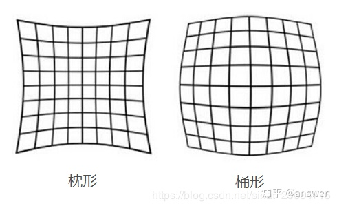

## [相机标定](https://blog.csdn.net/lql0716/article/details/71973318)

### 1. 常用术语

- 内参矩阵：将3D坐标变为2D坐标。
  $$
  K = \left[\matrix{
   f_x&s&x_0\\
   0&f_y&y_0\\
   0&0&1
  }\right]
  $$

  1. $f_x，f_y$表示焦距即焦点到图像平面的距离（实际含义为对应的x方向和y方向上的缩放程度）。很多情况下，二者会出现不同，因为数码相机的传感器缺陷，非均匀缩放，校准误差等等。

  2. $x_0，y_0$表示主点的偏移，主点就是对应的投影的照片的中点的偏移量。

  3. 可将内参矩阵变换为：2D平移、2D缩放、2D切变的乘积
     $$
     K = \left[\matrix{
      f_x&s&x_0\\
      0&f_y&y_0\\
      0&0&1
     }\right]
      = \left[\matrix{
      1&0&x_0\\
      0&1&y_0\\
      0&0&1
      }\right]
      \left[\matrix{
      f_x&0&0\\
      0&f_y&0\\
      0&0&1
      }\right]
      \left[\matrix{
      1&\frac{s}{f_x}&0\\
      0&1&0\\
      0&0&1
      }\right]
     $$

- 径向畸变（枕形或是桶形）：光线在远离透镜中心的地方更加弯曲。

  

- 切向畸变：由于透镜不完全平行于图像平面（传感器装备的时候与镜头间的角度没有对准）。
- 旋转矩阵：原本的图像发生了切向旋转，需要加以修正。
- 平移向量：即对应上述的$x_0,y_0$
- 重投影误差：首次对三维空间的位置进行照相（首次投影），而后经过三角定位法和重建的三维坐标进行二次投影，二者之间的误差为冲投影误差。[重投影误差讲解](https://www.cnblogs.com/Jessica-jie/p/7739775.html)
- 三角定位法：使用两台或者是两台以上的相机对空间中的一个位置进行定位。

### 2. 坐标系转换

- 三维坐标系均需要满足右手法则

- 世界坐标系（三维直角坐标系）：测量坐标系，为以真实世界为中心建立的坐标系，可以定位相机和待测物体的位置。

- 相机坐标系（三维直角坐标系）：原点位于镜头的光心处，x、y轴分别与相面的两边平行，z轴为镜头的光轴，与相平面平行。

  - 光轴（主光轴）：光轴就是垂直于凸透镜与凸透镜切面垂直的假想的轴
  - 光心：光轴与镜头的交界处。

- 图像像素坐标系（二维直角坐标系）：表示图像中三维点在二维平面中的投影，原点在CCD图像[^利用光学传感器得到的图像]平面的左上角

- [世界坐标系和相机坐标系之间是可以相互转换的](https://blog.csdn.net/qq_15029743/article/details/90215104)：（低表w表示世界坐标系，低标c表示相机坐标系）
  $$
  \left[\matrix{
  x_c\\
  y_c\\
  z_c\\
  1
  }\right]=
  \left[\matrix{
  R&t\\
  0&1
  }\right]
  \left[\matrix{
  x_w\\
  y_w\\
  z_w\\
  1
  }\right]
  $$
  